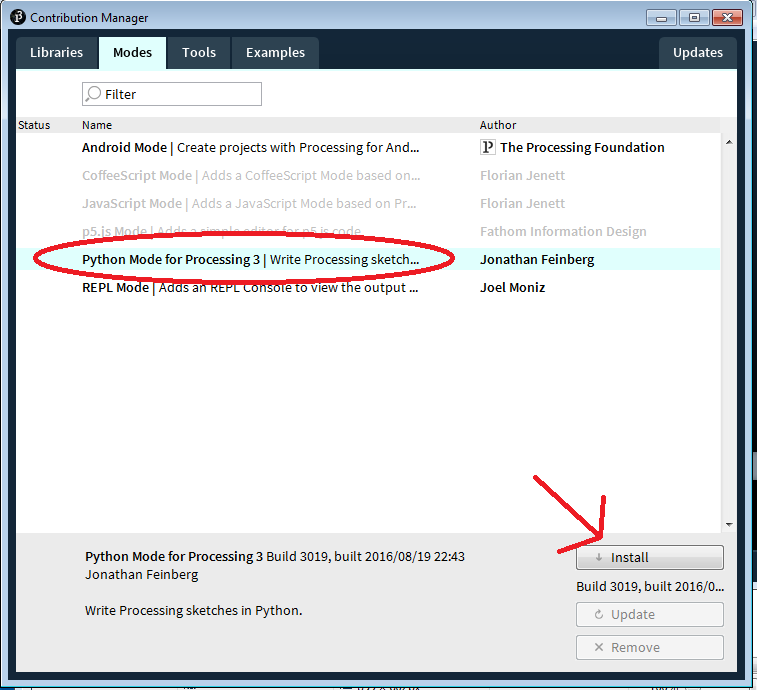
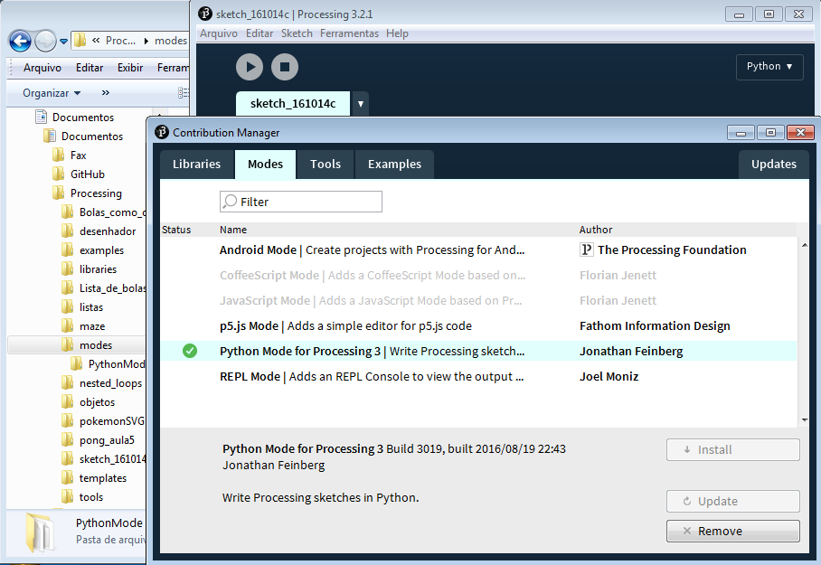

----

# How to install Processing Python Mode

[[Portuguese-language version](/index.md)]

[**Processing**](http://processsing.org) is a Free and Open Source (FLOSS) programming platform started in 2001 by Casey Reas e Ben Fry, widely used by artists and  to teach coding in a visual context. The Processing IDE is a text editor for code that can quickly execute your programs, called *sketches*.

With Processing you can not only generate raster and vector graphics, but interactive applications running on Linux, macOS or Windows. It's community benefits from a rich ecossystem of people creating and sharing educational resources and code libraries.

Standard Processing is based on the **Java** programming language but there are two other projects supported by the Processing Foundation that you might want to try:

-   [P5\*JS](https://p5js.org/) (a **JavaScript** library );
-   [Processing Python Mode](https://py.processing.org/) (based on Jython, a **Python** implementation running on the JVM).

Both can be added to the traditional Processing IDE. So let's see **how to install Processing Python Mode** (which hopefully is the reason you are reading this).

Visit downloads at the Processing site (<http://www.processing.org/download>), and choose your OS.

There is no installer, you just unzip/extract a folder. This is how it looks on Windows:

On macOS it's almost the same, and on Linux, you can open a Terminal window, point it to the decompressed downloaded folder and type *./processing* (you may also want to execute *install.sh* and that should create a nice desktop shortcut to Processing)

Once the Processing IDE is launched, look for the modes menu on the top right corner and select *Add mode…*

Select the Python Mode on the list and click *Install* to get it. \[If this fails, see more instructions down below].

A *Processing* folder will be created under the user's *Documents* on Windows and macOS (On Linux the folder is called *sketchbook*), there you'll find your *sketches* (programms), tools, modes and libraries. This is how it looks when you've finished:

Note: If you are under some restrictive proxy our without Internet acess you can download [PyhtonMode.zip](http://py.processing.org/3/PythonMode.zip) and manualy copy it (on Windows & Mac OS) under *Documentos &gt; Processing &gt; modes &gt;* PythonMode. On Linux, under your *sketchbook* folder. Firewalls may disturb Python Mode as there is a helper process that tries to connect online. Another known issue is working with non-ASCII OS usernames & paths.

PS: How about a sketch to test it?

[github.com/villares/py.processing-play](https://github.com/villares/py.processing-play)

----

Alexandre B A Villares ([abav.lugaralgum.com](https://abav.lugaralgum.com)), [CC-BY-NC-SA-4.0 License](https://creativecommons.org/licenses/by-nc-sa/4.0/)
