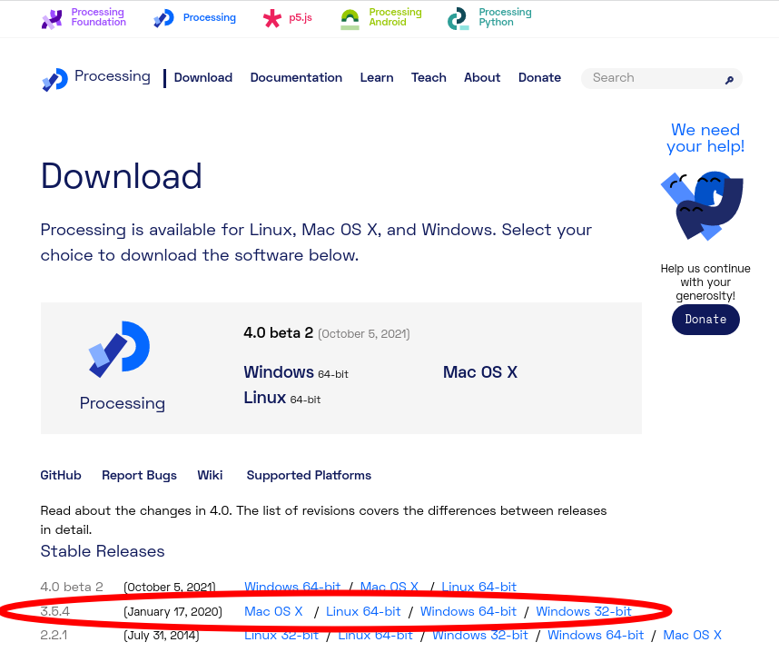
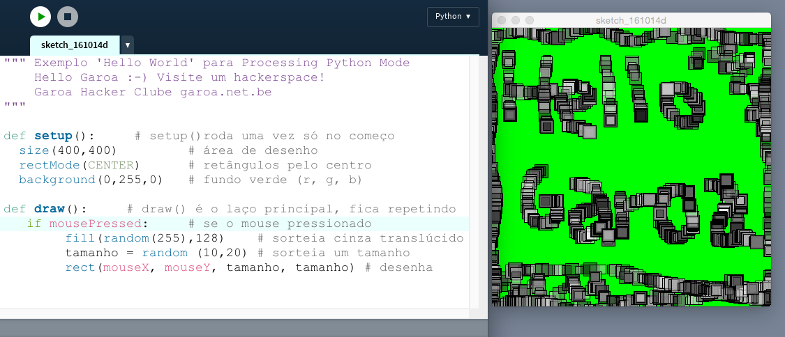

[[English version](index-EN.md)]

# Como instalar o Processing modo Python

> **Warning**
> Recomendo não usar mais **Processing Python Mode**, a não ser que você precise executar projetos antigos
> Se você está começando agora, considere ler sobre **py5** e [como instalar py5](https://abav.lugaralgum.com/como-instalar-py5/index.html)

### O que é isso?

[**Processing**](http://processing.org) é uma plataforma livre/aberta de programação criada em 2001 por Casey Reas e Ben Fry, largamente utilizada por artistas e designers, assim como para o ensino de programação num contexto visual. O Processing IDE (da sigla em inglês para ambiente integrado de desenvolvimento), simplificando, é um editor de texto apropriado para código, que permite executar programas escritos por você, conhecidos como *sketches*.

Processing permite não só criar programas que produzem imagens e eventualmente as exportar como bitmaps (PNG, JPG), animações ou arquivos vetoriais 2D e 3D (PDF, SVG e DXF entre outros), mas mais do que isso permite gerar executáveis, aplicativos autônomos e interativos, "empacotados" para Linux, macOS ou Windows. A comunidade desfruta de um rico ecossistema de pessoas que produzem recursos como exemplos didáticos e bibliotecas de código livremente compartilhadas.

A versão ‘standard’ do Processing é baseada na linguagem de programação **Java**, mas hoje existem dois outros projetos importantes da [Fundação Processing](https://processing.org) que você pode querer conhecer:

- [P5\*JS](https://p5js.org/) (baseado na linguagem **JavaScript)**;
- [Processing Python Mode](https://py.processing.org/) (baseado em Jython, implementação da linguagem **Python** na JVM).

Ambos podem ser adicionados ao Processing IDE tradicional. Vejamos a seguir **como instalar o Processing Modo Python**, que é o assunto desta página.

### Passos para instalar

#### 1. Download do Processing IDE

Entre na parte de downloads do site do Processing (<http://www.processing.org/download>), escolha o seu sistema operacional e baixe.

# Evite ainda o Processing 4 que está em testes, use por enquanto o Processing 3.5.4!

#### 2. Descomprimir/deszipar e abrir o IDE

Saiba que não há um instalador, você precisa descomprimir a pasta que baixou (deszipar) e se quiser pode mover a pasta como um todo, mas não tire o arquivo executável da pasta.

No Windows e no MacOS você abre o Processing IDE com um duplo clique. No Linux, para lançar o Processing, abra um terminal apontado para a pasta descomprimida e digite *./processing* (você pode executar o *install.sh* que cria um atalho que pode ser duplo-clicado no desktop).

Veja como fica no Windows (no macOS é praticamente a mesma coisa)

#### 3. Abrir o gerenciador de "modos"

Uma vez lançado o IDE do Processing, procure no menu de modos o item *Adicionar modo…* (ou *Add mode…* se estiver em inglês). 

#### 4. Baixando e instalando o modo Python

Procure na lista do painel o "Python Mode", selecione e peça para instalar usando o botão na parte de baixo. 

> \[Se esta etapa falhar, veja as observações mais abaixo].

#### 5. Conferindo se está tudo certo e conclusão

Confira se aparece a marca verde da instalação bem sucedida e no menu de modos mude para o modo Python!

Pode ser preciso fechar e abrir o Processing em alguns casos. Note que na pasta *Documentos* do usuário será criada uma pasta *Processing*, onde ficarão seus *sketches* (programas), ferramentas, modos e bibliotecas. No Linux a pasta criada se chama *sketchbook*. Este é o estado final quando a instalação terminou:

**Observações:** 

- Caso não seja possível instalar o modo Python de dentro do IDE (redes com filtros ou proxies restritivas) você pode baixar, deszipar [PyhtonMode.zip](http://py.processing.org/3/PythonMode.zip) e colocar manualmente (no Windows e Mac OS) em *Documentos &gt; Processing &gt; modes &gt;* PythonMode.
- Nomes de usuário com caracteres não-ASCII e firewalls podem atrapalhar o funcionamento do IDE.

#### Que tal um programinha para testar?

#### [Material didático aberto sobre o Processing modo Python](https://abav.lugaralgum.com/material-aulas/)

----

Alexandre B A Villares ([abav.lugaralgum.com](https://abav.lugaralgum.com)), [CC-BY-NC-SA-4.0 License](https://creativecommons.org/licenses/by-nc-sa/4.0/)
