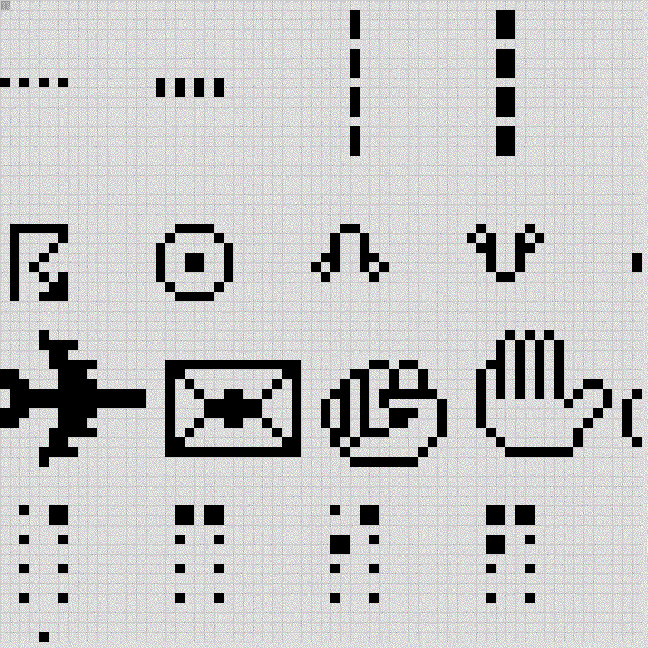
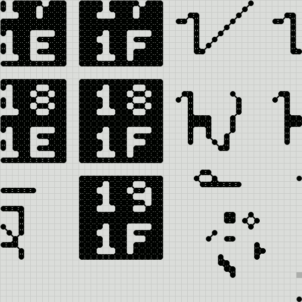

----

## v344

Unicode is one of the contemporary era marvels, to try and encode all human made glyphs and allow collaboration between peoples is amazing. We benefit everyday from Free and Open Source software and fonts. This works tries to explore and reinterpret [GNU Unifont pixel font](https://unifoundry.com/unifont/), that aims to cover large parts of the Unicode Basic Multilingual Plane, as a source of playful patterns.

This idea started in a [sketch-a-day](https://abav.lugaralgum.com/sketch-a-day) daily study from 2018, using [Processing Python mode](https://py.processing.org), and was converted in 2023 to run using the [py5 Python library](https://py5coding.org) (a new tool that combinesProcessing 4 Java graphics infrastructure and modern Python 3), it picks data from the  GNU Unifont pixel font and reinterprets it (recodes) as source for pattern and glyph exploration.

Code and images: [github.com/villares/villares.github.io/tree/master/selected-work/v344](https://github.com/villares/villares.github.io/tree/master/selected-work/v344)

